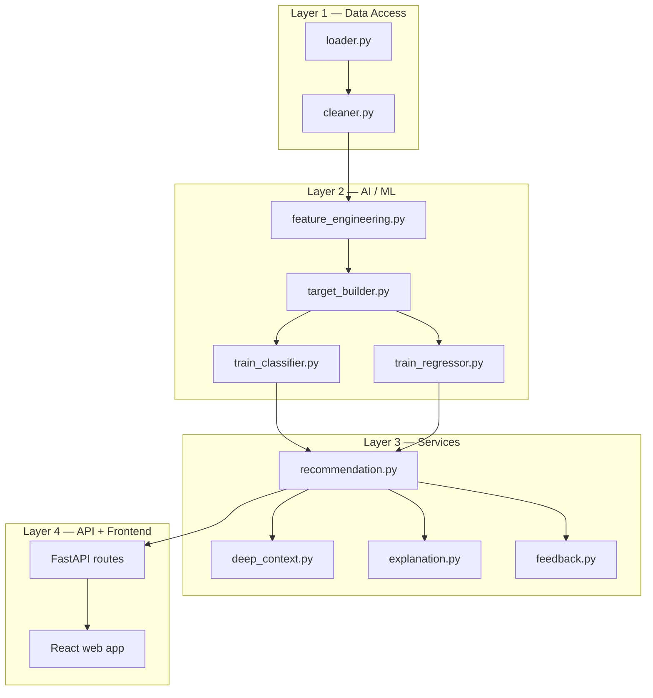

# 🧠 SalesTeam AI

**An intelligent order recommendation copilot for field sales representatives.**

SalesTeam AI predicts what products a client will need, how many units to suggest, how urgent the reorder is, and generates a plain-language explanation for every recommendation — all in real time, before the sales rep even walks into a point of sale.

---

## 📋 Table of Contents

- [The Problem](#-the-problem)
- [What the System Does](#-what-the-system-does)
- [Architecture](#-architecture)
- [Tech Stack](#-tech-stack)
- [Project Structure](#-project-structure)
- [The Two ML Models](#-the-two-ml-models)
- [Business Rules Layer](#-business-rules-layer)
- [LLM-Generated Explanations](#-llm-generated-explanations)
- [API Endpoints](#-api-endpoints)
- [Getting Started](#-getting-started)
- [Data Pipeline](#-data-pipeline)
- [Known Limitations](#-known-limitations)
- [Roadmap](#-roadmap)

---

## 🎯 The Problem

Field sales reps visit hundreds of points of sale. At each visit, they decide which products to propose and how much of each — a decision currently made from memory, gut feeling, or static price lists.

This leads to three concrete issues:

| Problem | Impact |
|---|---|
| **Missed upselling** | Reps forget products the client is overdue to reorder |
| **Wrong quantities** | Over-suggesting wastes shelf space; under-suggesting causes stockouts |
| **Inconsistent performance** | Experienced reps outperform juniors because knowledge lives in people, not data |

**SalesTeam AI** turns ~78,500 historical order lines and 18,400+ invoices into a personalized, ready-to-validate order proposal, delivered in real time.

---

## ✅ What the System Does

For every client visit, the system answers four questions:

- **What?** — Which products (out of 632) are relevant for this client right now
- **How much?** — What quantity to suggest, bounded to realistic historical ranges
- **How urgent?** — Is this an overdue reorder (⚡ Urgent) or a good opportunity (✅ Recommended)
- **Why?** — A plain-French explanation citing real order history, generated on demand

The sales rep reviews each suggestion and accepts, modifies, or rejects it — this feedback feeds back into future model retraining.

---

## 🏗️ Architecture

The system is organized into 4 strictly separated layers — each layer only talks to the one directly below it, so infrastructure changes (e.g. swapping the data source or the LLM provider) never ripple through the whole codebase.



---

## 🛠️ Tech Stack

| Layer | Technology |
|---|---|
| Data processing | Python, pandas |
| Machine Learning | XGBoost, scikit-learn |
| API | FastAPI, Pydantic |
| LLM explanations | Groq API (Llama 3.3 70B) |
| Frontend | React (Vite) |
| Model persistence | joblib |
| Deployment (planned) | Docker, Docker Compose |

---

## 📁 Project Structure

```
salesteam_ai/
├── data/
│   ├── raw/                    # Source Excel files (never modified)
│   └── processed/              # Cleaned CSVs + ML artifacts
│
├── src/
│   ├── data/                   # Layer 1 — Loading & cleaning
│   │   ├── loader.py
│   │   └── cleaner.py
│   │
│   ├── features/               # Layer 2 — Feature engineering
│   │   └── feature_engineering.py
│   │
│   ├── models/                 # Layer 2 — Training & artifacts
│   │   ├── target_builder.py
│   │   ├── train_classifier.py
│   │   ├── train_regressor.py
│   │   └── *.joblib / *.json
│   │
│   ├── services/               # Layer 3 — Business logic
│   │   ├── recommendation.py   # Main orchestration pipeline
│   │   ├── deep_context.py     # Evidence assembly for explanations
│   │   ├── explanation.py      # LLM + rule-based text generation
│   │   └── feedback.py
│   │
│   └── api/                    # Layer 4 — API
│       ├── main.py
│       ├── schemas.py
│       └── routes/
│
├── frontend/                   # Layer 4 — React web UI
│   └── src/App.jsx
│
└── notebooks/                  # Exploration, analysis & validation studies
```

---

## 🤖 The Two ML Models

The system answers "will they buy?" and "how much?" with two separate, purpose-built models — never one model trying to do both.

### 1. Purchase Classifier (XGBoost)

Predicts the probability that a client will order a given product on a specific visit.

- **Target definition:** visit-level — for each real invoice date, the label is whether that exact product was ordered on that visit, using only information known before that date (strict temporal integrity, no future leakage)
- **Split:** temporal — train ≤ Dec 2025, validation Q1 2026, test Q2 2026+
- **Result:** ROC-AUC ≈ 0.86 (a realistic score, replacing an earlier faulty 0.9999 caused by a data leakage bug)

### 2. Quantity Regressor (XGBoost)

Predicts the optimal order quantity, but only for products the classifier has already flagged as likely.

- Trained only on real positive purchases
- **Objective function:** `reg:absoluteerror` (L1 loss) — chosen after empirical testing showed it outperforms the standard squared-error loss on this dataset's highly skewed order volumes
- Includes `median_qty` as an input feature alongside the mean, improving robustness to outlier orders
- **Safety net:** if a client's purchase history is too erratic (coefficient of variation > 1.0), the system bypasses the regressor entirely and falls back to a simple historical average

---

## ⚖️ Business Rules Layer

Raw ML scores are adjusted with business logic before being shown to the sales rep:

```
final_score = ml_score × timing_boost × trend_boost
```

| Factor | Logic |
|---|---|
| **Timing boost** | 1.0× → 3.0×, scaled by how overdue the client is on their usual reorder cycle |
| **Trend boost** | +20% for growing demand, −30% for declining demand |
| **Quantity clamping** | Predictions are bounded to [0.5× historical min, 2.0× historical max] — prevents unrealistic suggestions |
| **Urgency split** | ⚡ Urgent (up to 7 products) vs ✅ Recommended (up to 5 products) |

---

## 💬 LLM-Generated Explanations

Every suggestion comes with a French-language explanation, generated via the **Groq API (Llama 3.3 70B)**, with two levels of depth:

| Mode | Trigger | Length | Content |
|---|---|---|---|
| **Short** | Every card, on load | 15–25 words | Quick one-line justification |
| **Detailed** | On user click ("Justifier") | 4 structured sections | *Why this product? Why this quantity? Why this rank? Why this urgency?* — each grounded in real cited order history |

**Key design principle:** the LLM never calculates anything — it only writes text around numbers already computed by the ML models. This prevents hallucinated quantities or invented facts. A deterministic rule-based fallback takes over automatically if the LLM API is unavailable or its quota is exhausted.

---

## 🔌 API Endpoints

| Method | Path | Purpose |
|---|---|---|
| `POST` | `/api/recommend` | Generate a full order proposal for a client visit |
| `POST` | `/api/explain-detailed` | On-demand 4-part explanation for one product |
| `GET` | `/api/clients` | List available clients |
| `POST` | `/api/feedback` | Record a rep's accept/modify/reject decision |
| `POST` | `/api/retrain` | Trigger model retraining |
| `GET` | `/health` | API status check |

---

## 🚀 Getting Started

```bash
# 1. Clone and set up the environment
git clone <repo-url>
cd salesteam_ai
python -m venv venv
source venv/bin/activate          # Windows: venv\Scripts\activate
pip install -r requirements.txt

# 2. Configure environment variables
cp .env.example .env
# Fill in GROQ_API_KEY and any other required values

# 3. Run the data pipeline (one-time setup)
python -m src.data.cleaner
python -m src.features.feature_engineering
python -m src.models.target_builder
python -m src.models.train_classifier
python -m src.models.train_regressor

# 4. Start the API
uvicorn src.api.main:app --reload --port 8000

# 5. Start the frontend (separate terminal)
cd frontend
npm install
npm run dev
```

---

## 🔄 Data Pipeline

```
Raw Excel files (invoices, order lines, GPS)
        ↓
loader.py + cleaner.py
        ↓
Clean CSVs → joined main_table.csv
        ↓
feature_engineering.py
        ↓
feature_matrix.csv (per client-product features)
        ↓
target_builder.py
        ↓
training_set.csv (visit-level, leakage-free)
        ↓
train_classifier.py / train_regressor.py
        ↓
Serialized .joblib models
        ↓
recommendation.py (real-time)
        ↓
Ranked, explained order proposal → sales rep
```

---

## ⚠️ Known Limitations

- **GPS-based geographic features** are currently underused — coverage is partial (~44% of clients) and not yet integrated as an aggregated proximity signal
- **Feedback loop retraining** is triggerable via API but not yet scheduled automatically
- **Seasonality** is modeled at category × quarter granularity; the underlying statistical signal is real but modest (confirmed via Kruskal-Wallis testing), not yet strong enough to be a dominant driver on its own
- **New product / promotion handling** is intentionally excluded from the ML pipeline (these are business/catalog decisions, not behavioral predictions) — a lightweight backoffice mechanism is planned but not yet built
- **Deployment** (Docker, hosting, authentication) is not yet implemented — this repository currently represents the ML + API + demo frontend layer only

---

## 🗺️ Roadmap

- [ ] Containerize with Docker + Docker Compose
- [ ] Add API authentication and rate limiting
- [ ] Migrate feedback storage from CSV to a proper database
- [ ] Automate weekly retraining with drift detection
- [ ] Build a lightweight backoffice for new products / promotions
- [ ] Evaluate a native mobile app (Flutter) for offline-first field use
- [ ] Add SHAP-based feature attribution for fully quantified "why" explanations

---

## 📄 License

To be defined.
